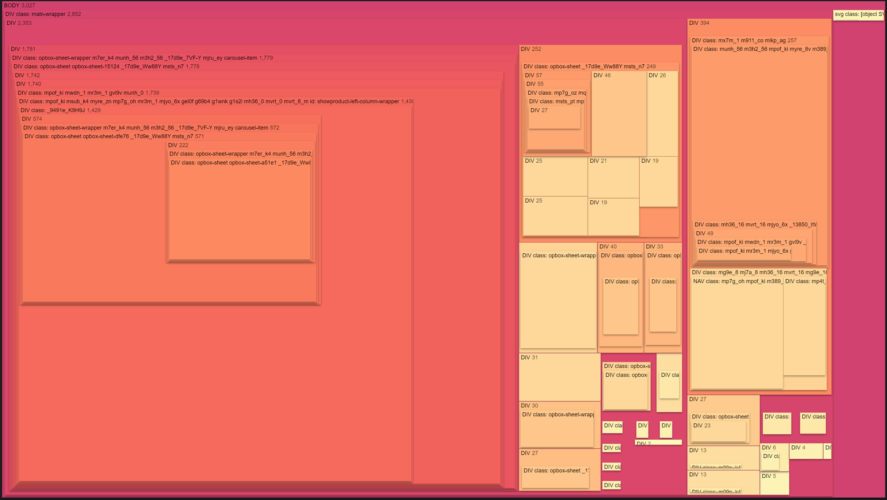

# HTML DOM tree visualizer
Simple visualization of HTML DOM tree. Tree map rendered with [d3.js](https://d3js.org/).



# How to use
1. Clone this repository
2. Generate DOM tree as JSON with `json.generator.js` script.

[Hint]: you can change entry dom element in script, default to `document.body`

3. Save file as .json, e.g. `tree.json`
4. Open `index.html` and change path to your JSON file at the very start of the script
```
import data from "./[PATH_TO_YOUR_FILE].json" assert { type: "json" };
```
5. Open `index.html` in your browser
If your file have correct format, you should see something like this:
